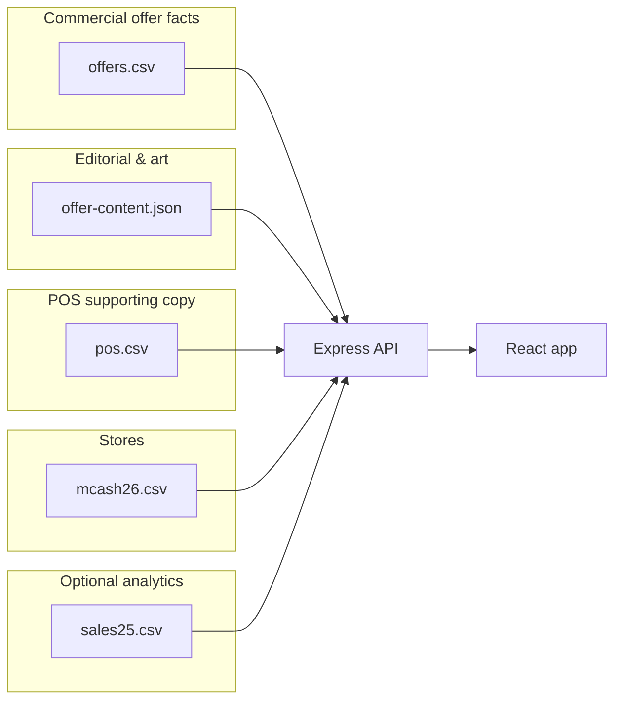

# Metcash26 application overview

This document describes what the app does, how the pieces fit together, and **every major data file** (CSVs, JSON, and where copy lives). For offer-column specifics, see [`../backend/OFFERS_CSV.md`](../backend/OFFERS_CSV.md). For editorial vs POS workflow, see [`../backend/EDITORIAL_WORKFLOW.txt`](../backend/EDITORIAL_WORKFLOW.txt).

---

## What it is

A **B2B expo ordering** web app for retail (and an **MSO** multi-store path): reps or buyers sign in, confirm a store, browse **offers** (SKUs, pricing, tiers), add lines to a cart, and submit an order. Optional **FY25 store sales** context comes from a separate sales file. The **backend** serves a JSON API, loads reference CSVs into **Postgres** (when DB is available), and in production-style runs can serve the **built React app** from `frontend/build` on the same port.

---

## Repository layout

| Path | Role |
|------|------|
| **`frontend/`** | React 18 + TypeScript (CRA). UI, cart, modals, dashboards. |
| **`backend/`** | Express 5 + Node; Postgres (`pg`); CSV ingest; static `/products` and SPA fallback. |
| **`package.json` (root)** | Render-style scripts: `render-build`, `render-start`, `restart`, `reload-api`. |
| **`render.yaml`** | Deploy wiring for a single service. |

---

## User-facing flow (retail)

Typical steps driven by `frontend/src/App.tsx`:

1. **Login** — `LoginScreen` (session email used for rep display / order metadata).
2. **User form** — `UserForm` (name, store number, position).
3. **Loading** — `LoadingStep` resolves store via API.
4. **Store confirm** — `StoreConfirm`; may open **FY25 sales** modal `StoreSalesDashboard` when data exists.
5. **Presentation** (optional) — in-app deck (`PresentationPlayer` / killer deck data).
6. **Offers listing** — `OffersListing` (`GET /api/offers`).
7. **Offer detail** — `OfferDetail` + `OfferDetailModal` (`GET /api/offers/:offerId`).
8. **Order summary** — `OrderSummary`; **POST `/api/save-order`** persists the order.
9. **Thank you / empty cart** — `EmptyCartThankYou`, etc.

**MSO flow** — `sessionFlow === 'mso'`: store picker → **`MsoOfferMatrix`** → split cart by store; can skip parts of the retail path.

Other UI: **`TopNav`**, **`Dashboard`** (internal charts), **`LearnMoreModal`**, **`Footer`**, **`LandscapeHint`**.

---

## Frontend building blocks

| Area | Location | Notes |
|------|-----------|--------|
| API base URL | `frontend/src/api.ts` | Uses `REACT_APP_API_URL` or browser origin; local `.env` often points to `http://localhost:5001`. |
| Offer carousel / cards | `OffersListing.tsx`, `OfferDetail.tsx` | Images and blurbs from API. |
| Offer modal | `OfferDetailModal.tsx` + `.css` | Editorial + POS sections; line-item cards. |
| Copy **labels** (not offer prose) | `frontend/src/content/modalCopy.ts` | Loading/errors, metric column titles, store-sales strings, POS section title. |
| Offer **display order / card images** | `frontend/src/config/offersDisplay.ts` | Typed UI ordering and image paths for known offer ids (not commercial data). |
| Drop months | `frontend/src/constants/dropMonths.ts` | Normalisation for promo windows. |

---

## Backend runtime

- **Entry:** `backend/server.js`
- **Port:** `PORT` or **5001**
- **DB:** Postgres — `offers` and `mcash_stores` tables are (re)created/loaded per current server logic; offers list/detail read from DB when healthy, with **CSV fallback** if queries fail.
- **Static files:** Serves `frontend/public/products` as **`/products`**; if `frontend/build` exists, serves the SPA and `index.html` for non-API routes.

---

## Data model (conceptual)

- **`offers.csv`** → SKU rows, costs, tiers, **OFFER** id (joined in the app).
- **`offer-content.json`** → Per-offer **marketing**: logos/heroes, `body` → API `message`, `h1`/`h2`, optional `callouts`, `modalTitle`, etc.
- **`pos.csv`** → Per-offer **POS-only** copy: `Description` + `Callout` (use `|` in **Callout** for multiple bullets). Exposed as API field **`pos`** `{ description, callouts }`.
- **`mcash26.csv`** → Store directory for lookup / picker.
- **`sales25.csv`** → Wide matrix: store + dollar values per offer column; powers **store sales** dashboard.

---

## CSV and data files (detailed)

### `backend/offers.csv` — **source of truth for the sales offer**

- **Loaded:** Into Postgres on startup / **`POST /api/reload-offers`** (with other reloads).
- **Purpose:** Every commercial line: **OFFER** id, **Offer Group**, **Brand**, **Description** (SKU text), **Qty**, **Expo Charge Back Cost**, **Expo Total Cost**, **Save**, RRP columns, optional **Offer Tier** for tiered deals, etc.
- **Important:** The **`OFFER`** value is the **offer id** everywhere in the app (URLs, cart, modals).
- **Formats:** Legacy header (current repo) is documented in [`OFFERS_CSV.md`](../backend/OFFERS_CSV.md). Unified/retail variants are supported by the importer when headers match those patterns.

### `backend/pos.csv` — **POS / supporting material (not SKU rows)**

| Column | Purpose |
|--------|---------|
| **OFFER** | Must align with **`offers.csv`** `OFFER` (matching is normalised: case/spacing/punctuation-insensitive). |
| **Description** | Longer POS / kit / shelf copy. |
| **Callout** | Short line(s). Split multiple bullets with **`|`** (pipe). |

Reload: same as offers — **`POST /api/reload-offers`** or server restart.

### `backend/mcash26.csv` — **Metcash / IGA store list**

- Used for **store search**, state/suburb/mcash pickers, and resolving **store id** to name, banner, address fields where mapped.
- Typical columns include store name, **Storeid** / store id, suburb, state, postcode, rank, banner, **Group** (MSO-style grouping where used).

### `backend/sales25.csv` — **FY25 store sales snapshot**

- **Header:** `Storeid`, `StoreName`, `State`, `Date`, `VALUE`, then **repeated blocks** of column headers aligned to offer names (sales dollars per offer category).
- **Used by:** `GET /api/store-sales/:storeId` after store confirm; drives **`StoreSalesDashboard`** copy (strings partly in `modalCopy.ts`).

### `backend/offer-content.json` — **editorial layer (not offers.csv)**

Array of objects keyed by **`offer`** (same id family as `OFFER`). Fields include **`logo`**, **`hero`**, **`productImage`** (filenames under `frontend/public/products/`), **`h1`**, **`h2`**, **`body`**, **`other`**, **`modalTitle`**, **`callouts`** (JSON array). Merged into **`GET /api/offers`** and **`GET /api/offers/:offerId`** after CSV meta. See [`EDITORIAL_WORKFLOW.txt`](../backend/EDITORIAL_WORKFLOW.txt).

### Other CSV / templates (reference or alternate pipelines)

| File | Typical use |
|------|----------------|
| `backend/offers.template.csv` | Retail-style column layout reference. |
| `backend/offers.unified.template.csv` | Unified layout with Logo/Hero/Message on sheet — see `OFFERS_CSV.md`. |
| `backend/offers.legacy.template.csv` | Legacy header + sample row. |
| `frontend/metcashoffers.csv` | Legacy / reference export; **not** the primary server ingest for `offers.csv`. |
| `backend/mcash26BU.csv`, `backend/xxxxxxx.csv` | Backup or scratch files; **not** required by the running app unless you wire them in. |

---

## JSON (non-offer)

- **`backend/offer-content.json`** — described above.
- **Order / DB** — Orders are persisted via Postgres through **`POST /api/save-order`** (see `server.js` for schema).

---

## Main HTTP API (summary)

| Method | Path | Purpose |
|--------|------|---------|
| GET | `/healthz` | Liveness. |
| GET | `/api/store/:storeNumber` | Store row from mcash / DB. |
| GET | `/api/store-data/:storeNumber` | Enriched store payload. |
| GET | `/api/states` | State list for pickers. |
| GET | `/api/suburbs?state=` | Suburbs for state. |
| GET | `/api/mcash-stores` | Mcash stores for suburb/state. |
| GET | `/api/mcash-groups` | Owner groups. |
| GET | `/api/mcash-stores-by-group` | Stores in a group (MSO). |
| GET | `/api/mcash-store-id` | Resolve store id helper. |
| GET | `/api/offers` | Grouped offers for listing (merged with editorial + POS). |
| GET | `/api/offers/:offerId` | One offer: tiers or flat **items**, totals, editorial + **pos**. |
| POST | **`/api/reload-offers`** | Reload **`offer-content.json`**, **`pos.csv`**, and **`offers.csv`** into DB. |
| POST | `/api/save-order` | Submit cart order. |
| GET | `/api/orders-stats` | Order statistics. |
| GET | `/api/store-sales/:storeId` | Sales25 slice for a store. |
| GET | `/api/dashboard`, `/api/dashboard/charts`, … | Internal dashboard data. |

---

## Scripts (root `package.json`)

| Script | What it does |
|--------|----------------|
| `npm start` | `render-start` → **`backend`** only (serves API + `frontend/build` if present). |
| `npm run build` | Installs backend + frontend deps, builds frontend (CI-friendly). |
| `npm run restart` | Rebuild frontend, kill :5001, start backend. |
| `npm run reload-api` | `curl POST /api/reload-offers` on localhost. |

---

## Environment (short)

**Backend (`backend/.env`):** `PORT`, `CORS_ORIGIN`, `PGHOST` / `PGPORT` / `PGUSER` / `PGPASSWORD` / `PGDATABASE`, `DATABASE_URL`, `DB_SSL`.

**Frontend (`frontend/.env`):** `REACT_APP_API_URL` (e.g. `http://localhost:5001` when CRA runs on :3000), `SKIP_PREFLIGHT_CHECK`, `DISABLE_ESLINT_PLUGIN`.

---

## Where to change what

| You want to change… | Edit… |
|---------------------|--------|
| SKU lines, costs, offer ids | `backend/offers.csv` → reload API |
| Shelf/POS blurbs only | `backend/pos.csv` → reload API |
| Hero, logo, marketing headline/body, editorial callouts | `backend/offer-content.json` → reload API |
| Button labels, “Qty (ctns)”, error strings | `frontend/src/content/modalCopy.ts` → rebuild frontend |
| Card order / static card art mapping | `frontend/src/config/offersDisplay.ts` → rebuild |
| UI behaviour / new screens | React under `frontend/src/` → rebuild |

---

## Related docs in this repo

- [`README.md`](../README.md) — quick start and env vars.
- [`backend/OFFERS_CSV.md`](../backend/OFFERS_CSV.md) — offer CSV formats and columns.
- [`backend/EDITORIAL_WORKFLOW.txt`](../backend/EDITORIAL_WORKFLOW.txt) — offers vs editorial vs POS reload workflow.
- [`backend/SALES25_OFFERS_MAP.md`](../backend/SALES25_OFFERS_MAP.md) — mapping sales25 headers to offer names (if present).
- [`docs/MSO-flow-sketch.md`](MSO-flow-sketch.md) — MSO flow notes (if still current).

---

*Last updated to reflect `pos.csv`, `offer-content.json`, and the split between commercial offers data and POS/editorial layers.*
